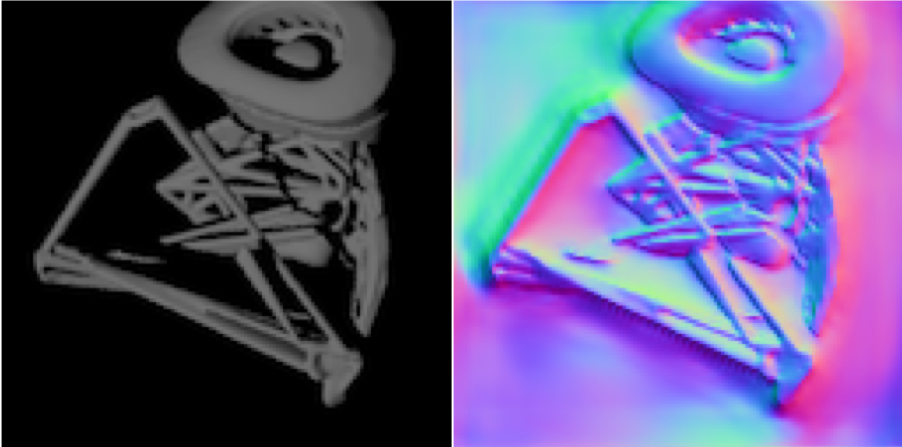

# single-image-surface-normal-estimation
PyTorch implementation of the hourglass architecture proposed in ["Single-Image Depth Perception in the Wild"](https://arxiv.org/abs/1604.03901) by Chen, et al. in NIPS 2016. Adapted for surface normal estimation instead of relative depth estimation.

## Data Format
Training data: single 128x128 RGB image of the object, its binary mask (white pixel only if object is present in that pixel), and a RGB image of the surface normal (where the color channels represent the 3D vectors).  
Validation: given a single 128x128 RGb image of the object and its binary mask, predict the surface normal orientation and output as a RGB image. Validation accuracy is calculated on the object's masked region, so not the background. There are 20,000 training images and 2,000 testing images to output predictions for. Data can be downloaded [here](http://cos429-f18.cs.princeton.edu/surface-normal-prediction-website-class-project/cos429.tgz).

**Sample input**:

**Sample output**:

## Installation
1. Make sure data is downloaded into `data/` folder (so inner contents are `train/` and `test/`).
2. Install necessary libraries: `conda env create -f environment.yml`.
3. Activate Anaconda environment: `source activate surface_normal`.
4. `python train.py` (on GPU)

## Reference
Chen, W., Fu, Z., Yang, D. and Deng, J., 2016. Single-image depth perception in the wild. In Advances in *Neural Information Processing Systems* (pp. 730-738)